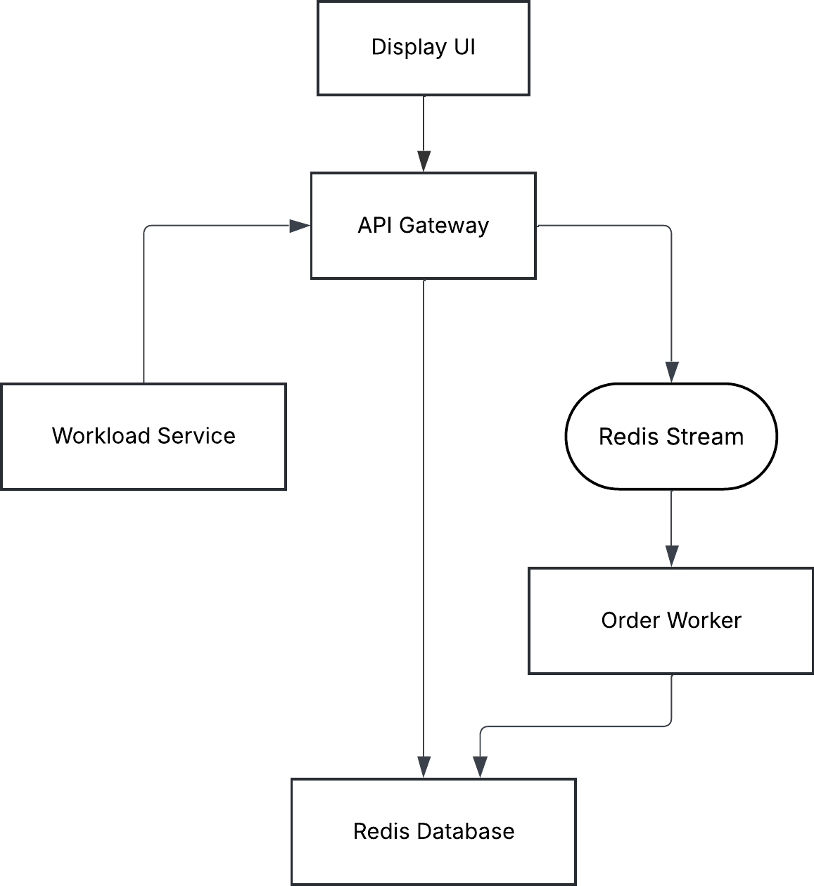

# Cloud-Native Ticketing System

This project implements a **distributed, cloud-native ticketing system** built using a microservices architecture and deployed with Docker containers and Kubernetes. It demonstrates modern application design patterns including asynchronous processing, event-driven workflow, Horizontal Pod Autoscaling (HPA), and workload simulation under realistic traffic.

---

## 1. Application Overview

The system provides a complete flow for browsing and purchasing tickets while showcasing Kubernetes autoscaling and microservice communication.

Users can:
- View available tickets  
- Create ticket orders  
- Have orders processed asynchronously  
- Generate artificial workload to trigger autoscaling  
- Access the entire system via a simple web frontend  

This application demonstrates:
- Microservices communication patterns  
- Asynchronous processing using **Redis Streams**  
- Horizontal Pod Autoscaling (HPA)  
- Containerized deployment using Docker  
- Kubernetes-based orchestration  

---

## 2. Architecture & Microservices Design

### Architecture Diagram


### High-Level Architecture

The system is composed of:

- **Frontend (React + Nginx)**  
- **API Gateway (Flask)**  
- **Order Worker (FastAPI)**  
- **Workload Generator (FastAPI)**  
- **Redis**  
  - Datastore  
  - Message/Event Stream (Redis Streams)

Redis is used for:
- Ticket and order storage  
- Asynchronous messaging  
- Stream-based event processing  

Each microservice runs as its own Kubernetes Deployment and communicates internally using Kubernetes DNS.  
The Workload Generator can run externally or inside the cluster.

---

## 3. Microservices Breakdown

### **1. API Gateway (Flask)**
The **public-facing REST API** that exposes:

- `GET /tickets`  
- `POST /orders`  
- `GET /orders/{orderId}`  

Responsibilities:
- Initializes ticket stock on startup  
- Writes ticket/order data to Redis  
- Publishes new orders into a **Redis Stream**  
- Acts as a **single entry point** (API Gateway Pattern)  
- Keeps the frontend decoupled from backend processing  
- Scales independently via Kubernetes HPA  

---

### **2. Order Worker (FastAPI)**
Asynchronous background processor that consumes events from the Redis Stream.

Responsibilities:
- Reads new order events from Redis Stream  
- Validates and decrements ticket stock  
- Confirms or rejects orders  
- Updates Redis with the final order status  
- Performs updates atomically  

This microservice demonstrates:
- Event-driven architecture  
- Decoupling of order submission vs order fulfillment  
- High-performance async processing  

---

### **3. Workload Generator (FastAPI + Async HTTP client)**
Generates controlled load to simulate real-world traffic.

Capabilities:
- Configurable **Requests-Per-Second (RPS)** load  
- Sends repeated `POST /orders` to API Gateway  
- Exposes endpoints to:
  - Start workload  
  - Stop workload  
  - Get workload configuration  
  - Report runtime statistics (latency, success, failure)  

Reasons for separating this service:
- Load generation remains independent from cluster internals  
- Clean demonstrations of autoscaling behavior  
- Traffic patterns are controlled and reproducible  

---

## 4. Cloud-Native & 12-Factor Principles

This project adheres to key **12-Factor App** guidelines:

### **Codebase**
- Single Git repository containing all services

### **Dependencies**
- Explicit dependency definitions (`requirements.txt`) for each microservice

### **Config**
- All configuration stored in environment variables  
  - e.g. Redis host, target API URL, internal service ports

### **Backing Services**
- Redis treated as an attached service  
- Services remain stateless (data persists only in Redis)

### **Build, Release, Run**
- Each service built as a Docker image  
- Kubernetes handles deployment, scaling, and rollouts  

### **Processes**
- All microservices run as **stateless processes**  
- Redis provides durable state

### **Port Binding**
- Each service binds to its own internal port  
- Exposed via Kubernetes Services  

### **Concurrency**
- Horizontal scaling via Kubernetes HPA  
- API Gateway and Worker scale independently  

### **Disposability**
- Pods can be safely restarted without data loss  
- Fast startup/shutdown for efficient scaling  

### **Dev/Prod Parity**
- Same container images used locally and in the cluster  

### **Logs**
- Services output structured logs to stdout/stderr  
- Kubernetes handles log aggregation  

### **Admin Processes**
- Admin/debug tasks can be executed via ephemeral Kubernetes pods

---

## 5. Useful Commands

### Kubernetes Inspection

```bash
kubectl get pods -n webapp-mq -o wide
kubectl get svc -n webapp-mq
kubectl get secrets -n webapp-mq
```

### CI/CD & Deployments

Gitlab CI/CD is setup for the main branch, and will automatically build the backend app, worker and frontend when a new commit is pushed to main. The following command restarts the deployment to apply the new changes.
```bash
kubectl rollout restart deployment frontend -n webapp-mq
```

If Gitlab is stuck, change the image tag and re-apply in project/k8s folder (mainly for demonstration purposes)
```bash
kubectl apply -f ./50-frontend-deployment.yaml
```

### Workload Generator (Autoscaling Demo)

Run workload generator locally (Need to build Dockerfile.workload_service first):
```bash
docker run --rm -it \
    -p 9000:9000 \
    -e TARGET_API=http://129.192.69.172:30050 \
    -e TARGET_RPS=5 \
    project-workload-service
```

Start load
```bash
curl -X POST http://localhost:9000/start
```

Monitor autoscaling (in separate terminals)
```bash
watch -n 2 kubectl get pods -n webapp-mq
```

```bash
watch kubectl get hpa -n webapp-mq
```

### Teardown & Redeploy
```bash
# Delete everything in the namespace
kubectl delete all --all -n webapp-mq

# Apply all manifests
kubectl apply -f k8s/
```

### Resilience testing 
Force delete a pod
```bash
kubectl delete pod frontend-<POD_ID> -n webapp-mq
```
Kubernetes will automatically recreate it.

---

## 6. OpenAPI

### Ticket Purchase API
```
openapi: 3.1.0
info:
  title: Ticket Purchase API
  version: 1.0.0
  description: API for browsing ticket types and purchasing tickets.

servers:
  - url: https://129.192.69.172:5000/v1

paths:
  /tickets:
    get:
      summary: Get available ticket types
      parameters:
        - in: query
          name: type
          schema:
            type: string
          description: Filter by ticket type
        - in: query
          name: min_price
          schema:
            type: number
          description: Minimum price filter
        - in: query
          name: max_price
          schema:
            type: number
          description: Maximum price filter
      responses:
        "200":
          description: List of available tickets
          content:
            application/json:
              schema:
                type: object
                properties:
                  tickets:
                    type: array
                    items:
                      $ref: "#/components/schemas/Ticket"

  /orders/{orderId}:
    get:
      summary: Get order details by ID
      parameters:
        - in: path
          name: orderId
          required: true
          schema:
            type: string
      responses:
        "200":
          description: Order details
          content:
            application/json:
              schema:
                $ref: "#/components/schemas/Order"
        "404":
          description: Order not found
          content:
            application/json:
              schema:
                $ref: "#/components/schemas/Error"

  /orders:
    post:
      summary: Create a new ticket order
      requestBody:
        required: true
        content:
          application/json:
            schema:
              $ref: "#/components/schemas/CreateOrderRequest"
      responses:
        "201":
          description: Order successfully created
          content:
            application/json:
              schema:
                $ref: "#/components/schemas/CreateOrderResponse"
        "400":
          description: Invalid request body
          content:
            application/json:
              schema:
                $ref: "#/components/schemas/Error"

components:
  schemas:

    Ticket:
      type: object
      properties:
        id:
          type: string
        name:
          type: string
        type:
          type: string
          example: "adult"
        price:
          type: number
          example: 25.00
        currency:
          type: string
          example: "USD"
        description:
          type: string

    OrderItem:
      type: object
      properties:
        ticketId:
          type: string
        type:
          type: string
        qty:
          type: integer
        unitPrice:
          type: number
        total:
          type: number

    Order:
      type: object
      properties:
        orderId:
          type: string
        customer:
          type: object
          properties:
            name:
              type: string
            email:
              type: string
        items:
          type: array
          items:
            $ref: "#/components/schemas/OrderItem"
        grandTotal:
          type: number
        currency:
          type: string
        status:
          type: string
          example: "confirmed"
        createdAt:
          type: string
          format: date-time

    CreateOrderRequest:
      type: object
      required:
        - customer
        - items
        - paymentMethod
      properties:
        customer:
          type: object
          properties:
            name:
              type: string
            email:
              type: string
        items:
          type: array
          items:
            type: object
            required:
              - ticketId
              - qty
            properties:
              ticketId:
                type: string
              qty:
                type: integer
        paymentMethod:
          type: string
          example: "credit_card"

    CreateOrderResponse:
      type: object
      properties:
        orderId:
          type: string
        status:
          type: string
        grandTotal:
          type: number
        currency:
          type: string
        message:
          type: string

    Error:
      type: object
      properties:
        error:
          type: string

```


### Database API
```
openapi: 3.1.0
info:
  title: Redis CRUD API
  version: 1.0.0
  description: REST API wrapper for CRUD operations on a Redis key-value store.

servers:
  - url: https://129.192.69.172:6379/v1

paths:
  /redis:
    post:
      summary: Create a new Redis key-value entry
      description: Creates a new key with a JSON value in Redis.
      requestBody:
        required: true
        content:
          application/json:
            schema:
              $ref: "#/components/schemas/CreateRedisEntry"
      responses:
        "201":
          description: Successfully created key
          content:
            application/json:
              schema:
                $ref: "#/components/schemas/SuccessMessage"
        "400":
          description: Invalid request body
          content:
            application/json:
              schema:
                $ref: "#/components/schemas/Error"

  /redis/{key}:
    get:
      summary: Read a Redis key-value entry
      description: Retrieves a value stored at the given key.
      parameters:
        - in: path
          name: key
          schema:
            type: string
          required: true
      responses:
        "200":
          description: Redis key value fetched successfully
          content:
            application/json:
              schema:
                $ref: "#/components/schemas/RedisEntry"
        "404":
          description: Key not found
          content:
            application/json:
              schema:
                $ref: "#/components/schemas/Error"

    put:
      summary: Update an existing Redis key
      description: Replaces the value at an existing Redis key.
      parameters:
        - in: path
          name: key
          schema:
            type: string
          required: true
      requestBody:
        required: true
        content:
          application/json:
            schema:
              $ref: "#/components/schemas/UpdateRedisEntry"
      responses:
        "200":
          description: Key updated successfully
          content:
            application/json:
              schema:
                $ref: "#/components/schemas/SuccessMessage"
        "404":
          description: Key not found
          content:
            application/json:
              schema:
                $ref: "#/components/schemas/Error"

    delete:
      summary: Delete a Redis key
      description: Removes a key from Redis.
      parameters:
        - in: path
          name: key
          schema:
            type: string
          required: true
      responses:
        "200":
          description: Key deleted successfully
          content:
            application/json:
              schema:
                $ref: "#/components/schemas/SuccessMessage"
        "404":
          description: Key not found
          content:
            application/json:
              schema:
                $ref: "#/components/schemas/Error"

components:
  schemas:

    CreateRedisEntry:
      type: object
      required:
        - key
        - value
      properties:
        key:
          type: string
          example: "user:1001"
        value:
          type: object
          description: JSON object to store at the key
          example:
            name: "Alice"
            age: 25
            role: "admin"

    UpdateRedisEntry:
      type: object
      required:
        - value
      properties:
        value:
          type: object
          description: JSON value to overwrite the existing key
          example:
            name: "Alice Anderson"
            age: 26
            role: "admin"

    RedisEntry:
      type: object
      properties:
        key:
          type: string
          example: "user:1001"
        value:
          type: object
          example:
            name: "Alice"
            age: 25
            role: "admin"

    SuccessMessage:
      type: object
      properties:
        message:
          type: string
          example: "Operation completed successfully"
        key:
          type: string
          example: "user:1001"

    Error:
      type: object
      properties:
        error:
          type: string
          example: "Key not found"
```
